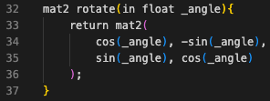
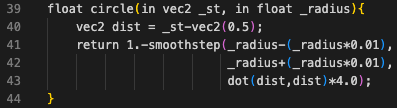
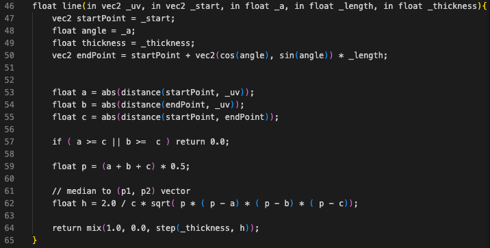

# CGI_Shader
In diesem Repo befindet sich die Prüfungsleistung des Moduls **Computergraphiken** von Dr. Johannes Riesterer im Kurz **TINF20IN**

Gruppengröße: **1**  
Name: **Jens Hocke**  
Matrikelnummer: **4793868**  
Email: **inf20065@lehre.dhbw-stuttgart.de**

## Aufgabe
Schreiben Sie einen GLSL Shader in WebGL und dokumentieren Sie seine Funktionsweise. Bewertet wird Kreativität, Verständlichkeit der Dokumentation und die Implementierung. Aus der Dokumentation sollte hervorgehen, auf welchen theoretischen Prinzipien das bildgebende Verfahren basiert, wie es algorithmisch umgesetzt werden kann und wie es implementiert wurde.  Als Orientierung für eine sehr gute Dokumentation dient https://thebookofshaders.com/. Ein Shader wird  als nicht sonderlich kreativ bewertet, wenn er nur eine geringe Variabilität zu Standard Beispielen aus gängiger Literatur oder Seiten wie https://thebookofshaders.com/ oder https://www.shadertoy.com/ aufweist. (100 Punkte)

## Idee

Die Idee bestand darin ein Fadenkreuz zu erstellen, welches aufgrund von Bewegung hin und her wackelt. Weiter sollte ein sich zufällig bewegendes Zielobjekt erstellt werden. Soweit ist es leider nicht gekommen.  
Geblieben ist ein Fadenkreuz welches mit einer integrierten Neigungs-Ansicht (ähnlich zu einer Wasserwaage) die aktuelle Neigung anzeigt. Zur Verdeutlichung neigt sich der Hintergrund mit.

## Rahmenbedingen

Der GLSL-Shader setzt die Software **Visual Studio Code** voraus. Zusätzlich wird folgende Erweiterung benötigt:

>Name: glsl-canvas  
>ID: circledev.glsl-canvas  
>Beschreibung: Live WebGL preview of GLSL shaders  
>Version: 0.2.15  
>Herausgeber: circledev  
>Link zum Visual Studio Marketplace: https://marketplace.visualstudio.com/items?itemName=circledev.glsl-canvas

Die in VS Code geöffnete .glsl Datei kann via der Befehlspallete (<kbd>ctrl</kbd>+ <kbd>shift</kbd> + <kbd>P</kbd>) und dem Befehl `show glslCanvas` ausgeführt und dargestellt werden.

## Einführung

Bei der Erstellung des Shaders wird sich an den Grundlagen aus **The Book of Shaders** orientiert.

## Shader

**Drehmatrix** in der rotate-Funktion ab Zeile 32:  
Hiermit wird der Hintergrund multipliziert, damit er sich parallel zu den innenliegenden Linien neigt.

**Kreise**: Zur Erstellung der Kreise wird die circle-Funktion genutzt ab Zeile 39:  
Hier wird zuerst der Abstand zwischen dem aktuellem Fragment und der Mitte des Canvas errechnet. Der Rückgabewert stellt den Kreis mit dem Radius _radius und einem Übergang von der Distanz 0.01 dar.

**Linien**: Zur Erstellung der Linien wird die line-Funktion genutzt ab Zeile 46:  
Der Linie wird mit _uv die aktuelle normalisierte Postion, mit _start der Startvektor (Startpunkt) der Linie, mit _a der Winkel ab Start, mit _length die Länge der Linie und mit _thickness die Dicke der Linie übergeben.

## Ergebnis

Hier ist ein gif-Video des Shaders:

## Diskussion

Einen Shader zu erstellen ist ein komplexes Unterfangen.  
Die Funktionsweise von Vertex- und Fragmentshader muss zu Beginn verstanden werden.  

Da es viele Wege gibt einen Fragmentshader mit WebGL zu realisieren, war hier zu Beginn die Verwirrung recht groß. Neben diesem Weg mit einer Erweiterung für VS Code, wurde auch die Implementierung in HTML5 mit JavaScript mit und ohne Library ausprobiert.
Aufgrund der direkten Vorschau wurde sich für diesen Weg (VS Code Erweiterung) entschieden.